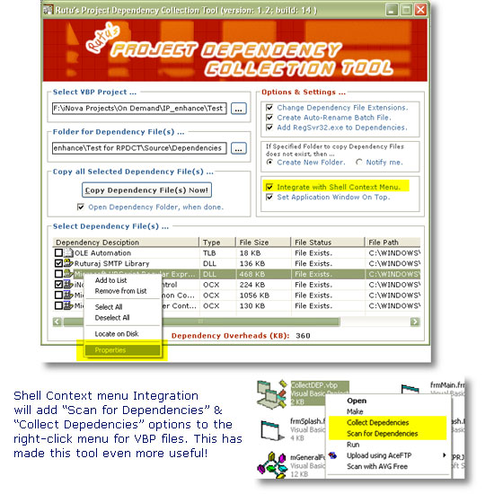



## Rutu's Project Dependency Collection Tool \(very useful Update: 23rd Feb 2006\)

### Description

I developed this project for own purpose and I thought this will prove equally helpful to you all as well, hence posting it on PSC. Upon selection of Visual Basic 6.0 Project File (*.vbp); this tool will scan the Project and list out all the OCXs, DLLs, TLBs which you have referenced from your Project and it will copy all Project dependency files to one single folder on one button click! There are few options provided to make it more useful and handy. Please read the included ReadMe.txt file for further details.

----

## Update 12th Feb 2006. Right-click Popup menu for Dependency List, press Esc key to close Splash screen, Open dependency file's folder from application interface. Please see Update_Log.pdf file for complete list of updated features.

----

Update 23rd Feb 2006. This is a very useful update. Two new features added. [1] Now you can access Properties dialog for Dependency File listed in List of Dependency Files. [2] Shell menu integration for VBP files.

----

 
### More Info
 

             |
---                |---
**Submitted On**   |2006-02-12 18:50:18
**By**             |[Ruturaaj](https://github.com/Planet-Source-Code/PSCIndex/blob/master/ByAuthor/ruturaaj.md)
**Level**          |Intermediate
**User Rating**    |5.0 (139 globes from 28 users)
**Compatibility**  |VB 6\.0
**Category**       |[Complete Applications](https://github.com/Planet-Source-Code/PSCIndex/blob/master/ByCategory/complete-applications__1-27.md)
**World**          |[Visual Basic](https://github.com/Planet-Source-Code/PSCIndex/blob/master/ByWorld/visual-basic.md)
**Archive File**   |[Rutu's\_Pro1975682232006\.zip](https://github.com/Planet-Source-Code/ruturaaj-rutu-s-project-dependency-collection-tool-very-useful-update-23rd-feb-2006__1-64287/archive/master.zip)

